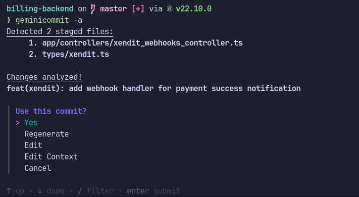

# geminicommit: Write Clear, Concise Git Commit Messages with Google Gemini AI

**Struggling to write meaningful commit messages?** geminicommit leverages Google's Gemini AI to generate **clear, precise, and properly structured commit messages** automatically, making your Git workflow smoother

## Key Features

- **AI-powered Message Generation:** Leverage Google Gemini AI to generate clear
  and descriptive messages, saving you time and brainpower.
- **Customizable:** Tailor the message generation process to your specific needs
  and preferences.
- **Conventional Commits Compliant:** Adhere to widely accepted commit message
  formatting standards for better project readability and maintainability.
- **Cross-Platform Compatibility:** Works seamlessly on Linux, Windows, and macOS.
  systems.
- **Free and Open Source:** Contribute to and benefit from the open-source community.

## Getting Started

### Installation

- **Build from source:** `go install github.com/tfkhdyt/geminicommit@latest`
<!-- - **Arch Linux (AUR):** `yay -S geminicommit-bin` -->
- **Standalone binary:** Download the binary file from
  [release page](https://github.com/tfkhdyt/geminicommit/releases) and move the
  binary to one of the `PATH` directories in your system, for example:
  - **Linux:** `$HOME/.local/bin/`, `/usr/local/bin/`
  - **Windows:** `%LocalAppData%\Programs\`
  - **macOS:** `/usr/local/bin/`

### Usage

1. Get your API key from [Google AI Studio](https://aistudio.google.com/app/apikey).
1. Run `geminicommit config key set <your-api-key>` to set your API key.
1. Stage your changes to git `git add file_name.go`.
1. Run `geminicommit` in your terminal.
1. Review the AI-generated message and customize it as needed.
1. `geminicommit` will automatically commit your changes with the generated
   message.
1. No more `git commit -m "update" 😁`

More details in `geminicommit --help`

## License

This project is licensed under the GPLv3 License. See the LICENSE file for details.
